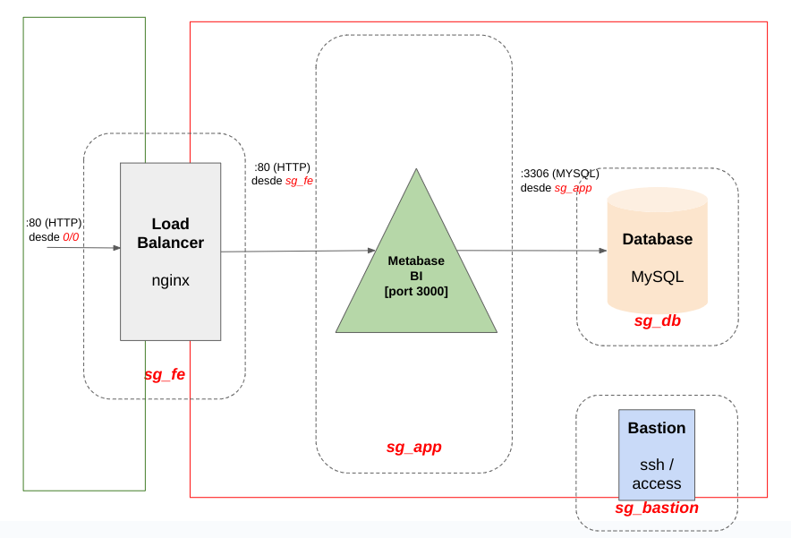
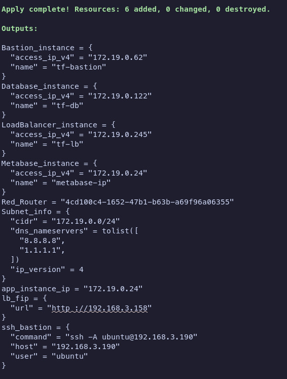
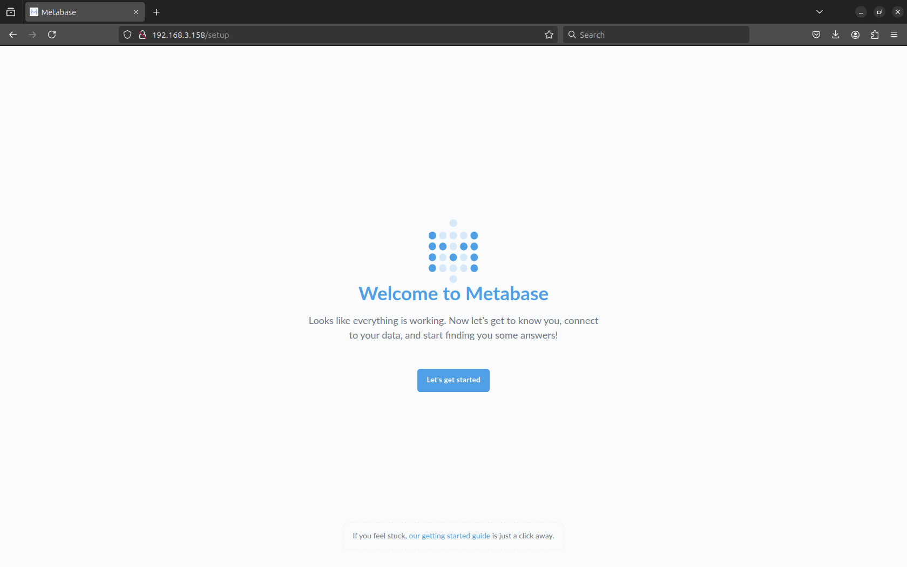
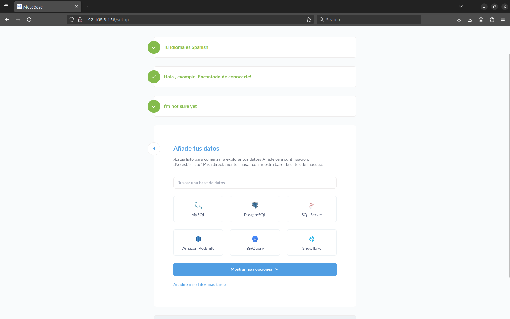
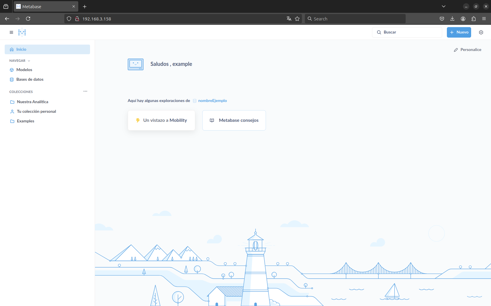

# Despliegue de Infraestructura con Terraform y OpenStack

Este proyecto utiliza Terraform y OpenStack para desplegar una infraestructura de red y varias instancias de computación. El proyecto consta de varios archivos de configuración de Terraform y scripts de shell para la inicialización de las instancias.

## Descripción de los archivos

1. `infra/templates/vm-app.init.sh`: Este script se encarga de la configuración e inicialización de una aplicación Java en una instancia de Ubuntu. Instala Java, configura las variables de entorno necesarias para la aplicación y descarga y ejecuta un archivo JAR de la aplicación.

2. `infra/templates/vm-db.init.sh`: Este script se encarga de la configuración e inicialización de una base de datos MySQL en una instancia de Ubuntu. Configura MySQL para permitir conexiones remotas, crea una base de datos y un usuario con todos los privilegios sobre esa base de datos, y descarga e importa un archivo SQL a la base de datos.

3. `infra/templates/vm-lb.init.sh`: Este script se encarga de la configuración e inicialización de un balanceador de carga Nginx en una instancia de Ubuntu. Instala Nginx, configura un servidor Nginx para reenviar las solicitudes a la dirección IP de la aplicación y reinicia Nginx.

## Cómo ejecutar el proyecto

Para ejecutar este proyecto, necesitarás tener instalado Terraform y tener acceso a un proveedor de OpenStack. Sigue estos pasos:

1. Configura tus credenciales de OpenStack en tu entorno o en un archivo de variables de Terraform.

2. Navega al directorio del proyecto y ejecuta `terraform init` para inicializar el directorio de trabajo de Terraform.

3. Ejecuta `terraform plan` para crear un plan de ejecución.

4. Ejecuta `terraform apply` para aplicar los cambios requeridos para alcanzar el estado deseado de la configuración.

Por favor, asegúrate de tener los permisos necesarios para ejecutar estos comandos y de tener instalado Terraform en tu sistema. Además, es posible que necesites modificar los archivos de configuración y los scripts para ajustar los nombres de las bases de datos, los nombres de usuario, las contraseñas y las direcciones IP según tu configuración específica.

## Arquitectura del Proyecto

## Salida de la Ejecución

Una vez ejecutado el proyecto, verás la siguiente salida en tu terminal (recuerda que los valores que aparecen serán diferentes a los de la imagen):

Al ingresar a la URL de la aplicación (lb_fip.url) nos encontraremos con el menú de la página principal de Metabase.

Al seguir las configuraciones y rellenar el usuario y el uso de la aplicación nos encontraremos con la configuración de la base de datos.

Seleccionamos MySQL y rellenamos con los datos proporcionados por nosotros. Al aceptar y terminar con la configuración veremos la pantalla principal.

Desde esta pantalla podremos configurar Metabase y hacer las consultas que queramos.